# 🏗️ WhatsApp Fitness Bot - Design Documentation

Comprehensive design documentation with system architecture, user flows, and pricing analysis for the AI-powered fitness coaching bot.

## 📋 Table of Contents
1. [System Architecture](#system-architecture)
2. [User Journey Flows](#user-journey-flows)
3. [Data Flow Diagrams](#data-flow-diagrams)
4. [Platform Comparison](#platform-comparison)
5. [Pricing Analysis](#pricing-analysis)
6. [Technical Specifications](#technical-specifications)
7. [Deployment Architecture](#deployment-architecture)

---

## 🏗️ System Architecture

### **High-Level Architecture**

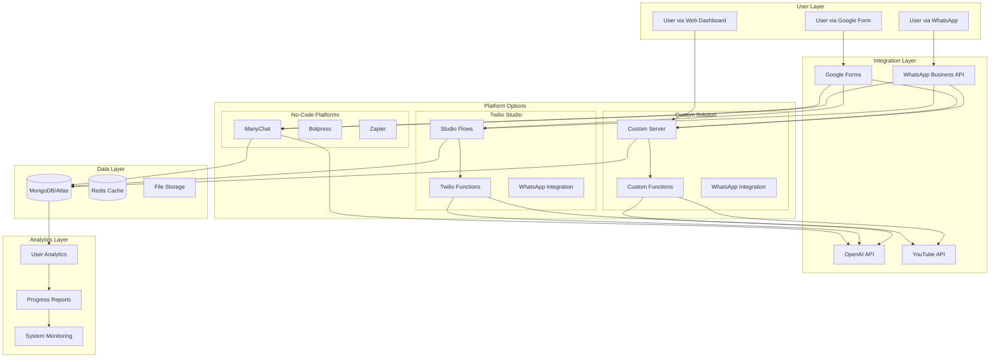
```mermaid
graph TB
    subgraph "User Layer"
        U1[User via Google Form]
        U2[User via WhatsApp]
        U3[User via Web Dashboard]
    end
    
    subgraph "Integration Layer"
        GF[Google Forms]
        WA[WhatsApp Business API]
        OA[OpenAI API]
        YT[YouTube API]
    end
    
    subgraph "Platform Options"
        subgraph "Twilio Studio"
            TS[Studio Flows]
            TF[Twilio Functions]
            TW[WhatsApp Integration]
        end
        
        subgraph "Custom Solution"
            CS[Custom Server]
            CF[Custom Functions]
            CW[WhatsApp Integration]
        end
        
        subgraph "No-Code Platforms"
            MC[ManyChat]
            BP[Botpress]
            ZP[Zapier]
        end
    end
    
    subgraph "Data Layer"
        DB[(MongoDB/Atlas)]
        CACHE[(Redis Cache)]
        STORAGE[File Storage]
    end
    
    subgraph "Analytics Layer"
        ANALYTICS[User Analytics]
        REPORTS[Progress Reports]
        MONITORING[System Monitoring]
    end
    
    U1 --> GF
    U2 --> WA
    U3 --> CS
    
    GF --> TS
    GF --> CS
    GF --> MC
    
    WA --> TS
    WA --> CS
    WA --> MC
    
    TS --> TF
    CS --> CF
    MC --> OA
    
    TF --> OA
    CF --> OA
    TF --> YT
    CF --> YT
    
    TS --> DB
    CS --> DB
    MC --> DB
    
    DB --> ANALYTICS
    ANALYTICS --> REPORTS
    REPORTS --> MONITORING
```

### **Twilio Studio Architecture**

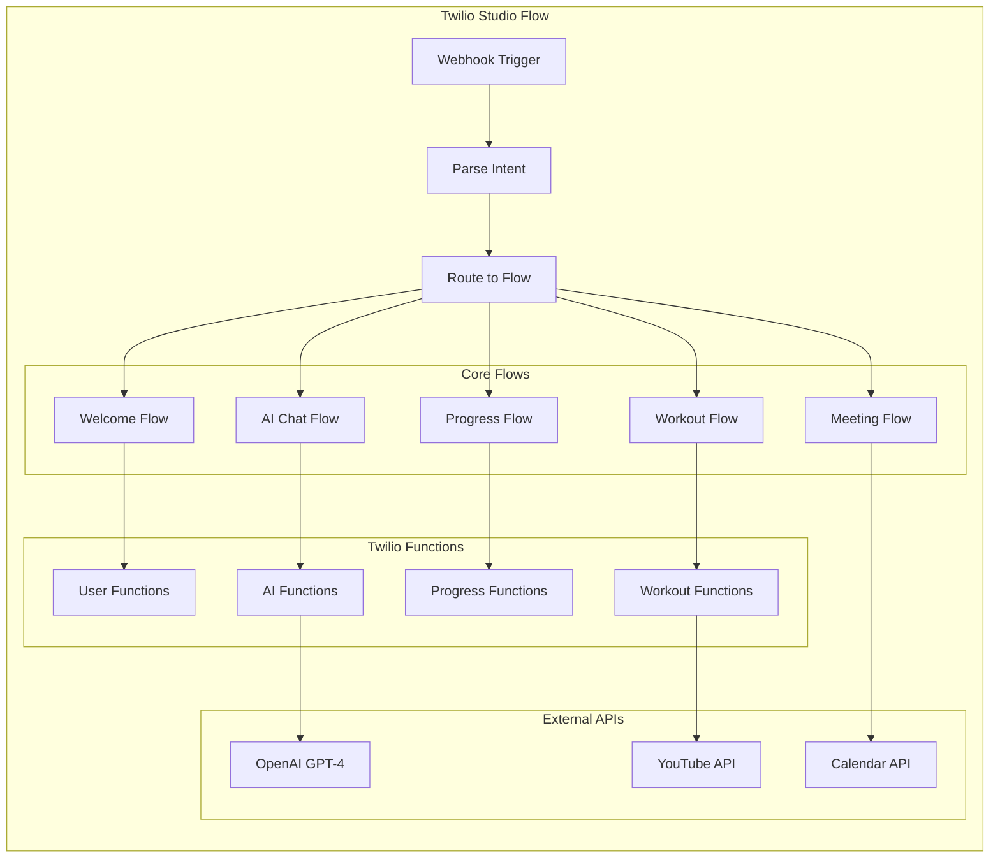
```mermaid
graph LR
    subgraph "Twilio Studio Flow"
        TRIGGER[Webhook Trigger]
        PARSE[Parse Intent]
        ROUTE[Route to Flow]
        
        subgraph "Core Flows"
            WELCOME[Welcome Flow]
            WORKOUT[Workout Flow]
            PROGRESS[Progress Flow]
            MEETING[Meeting Flow]
            AI[AI Chat Flow]
        end
        
        subgraph "Twilio Functions"
            UF[User Functions]
            WF[Workout Functions]
            PF[Progress Functions]
            AF[AI Functions]
        end
        
        subgraph "External APIs"
            OPENAI[OpenAI GPT-4]
            YOUTUBE[YouTube API]
            CALENDAR[Calendar API]
        end
    end
    
    TRIGGER --> PARSE
    PARSE --> ROUTE
    ROUTE --> WELCOME
    ROUTE --> WORKOUT
    ROUTE --> PROGRESS
    ROUTE --> MEETING
    ROUTE --> AI
    
    WELCOME --> UF
    WORKOUT --> WF
    PROGRESS --> PF
    AI --> AF
    
    WF --> YOUTUBE
    AF --> OPENAI
    MEETING --> CALENDAR
```

---

## 🔄 User Journey Flows

### **New User Onboarding Flow**

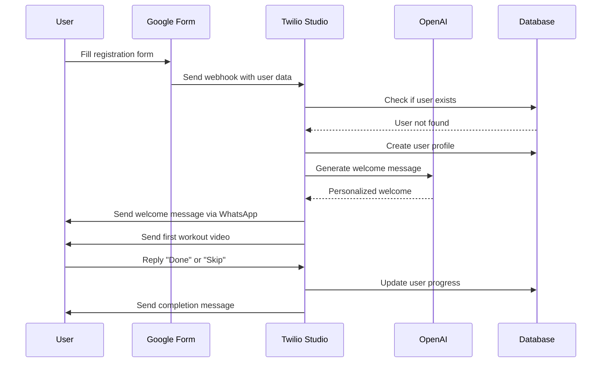
```mermaid
sequenceDiagram
    participant U as User
    participant GF as Google Form
    participant TS as Twilio Studio
    participant AI as OpenAI
    participant DB as Database
    
    U->>GF: Fill registration form
    GF->>TS: Send webhook with user data
    TS->>DB: Check if user exists
    DB-->>TS: User not found
    TS->>DB: Create user profile
    TS->>AI: Generate welcome message
    AI-->>TS: Personalized welcome
    TS->>U: Send welcome message via WhatsApp
    TS->>U: Send first workout video
    U->>TS: Reply "Done" or "Skip"
    TS->>DB: Update user progress
    TS->>U: Send completion message
```

### **Daily Workout Flow**

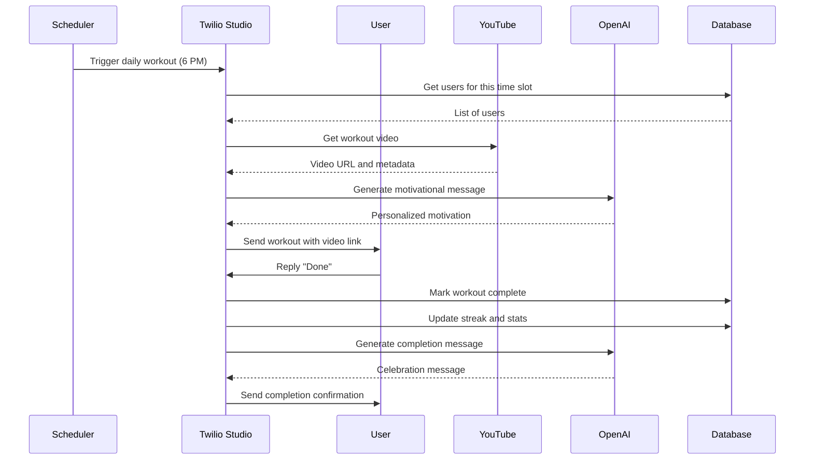
```mermaid
sequenceDiagram
    participant S as Scheduler
    participant TS as Twilio Studio
    participant U as User
    participant YT as YouTube
    participant AI as OpenAI
    participant DB as Database
    
    S->>TS: Trigger daily workout (6 PM)
    TS->>DB: Get users for this time slot
    DB-->>TS: List of users
    TS->>YT: Get workout video
    YT-->>TS: Video URL and metadata
    TS->>AI: Generate motivational message
    AI-->>TS: Personalized motivation
    TS->>U: Send workout with video link
    U->>TS: Reply "Done"
    TS->>DB: Mark workout complete
    TS->>DB: Update streak and stats
    TS->>AI: Generate completion message
    AI-->>TS: Celebration message
    TS->>U: Send completion confirmation
```

### **Progress Tracking Flow**

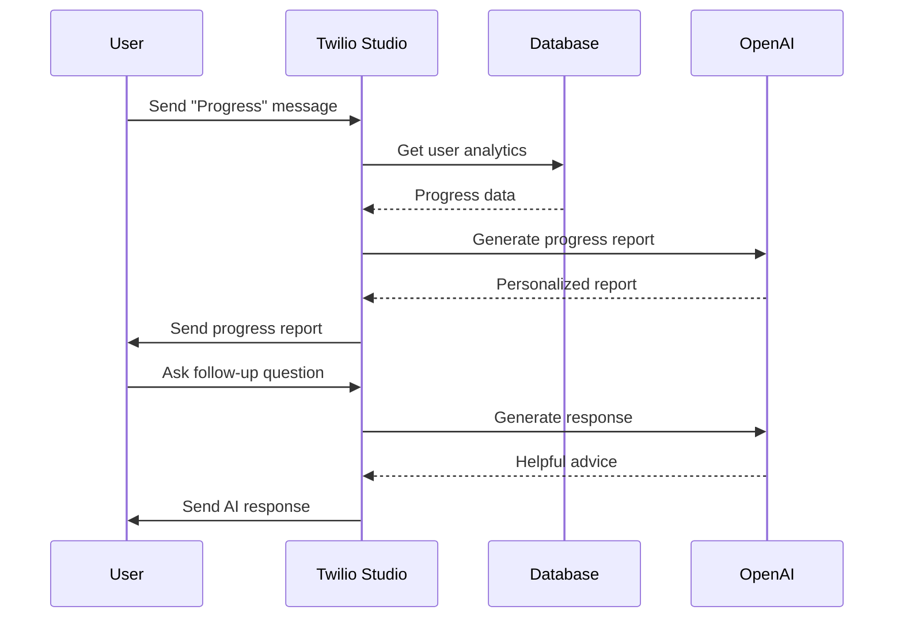
```mermaid
sequenceDiagram
    participant U as User
    participant TS as Twilio Studio
    participant DB as Database
    participant AI as OpenAI
    
    U->>TS: Send "Progress" message
    TS->>DB: Get user analytics
    DB-->>TS: Progress data
    TS->>AI: Generate progress report
    AI-->>TS: Personalized report
    TS->>U: Send progress report
    U->>TS: Ask follow-up question
    TS->>AI: Generate response
    AI-->>TS: Helpful advice
    TS->>U: Send AI response
```

### **Meeting Scheduling Flow**

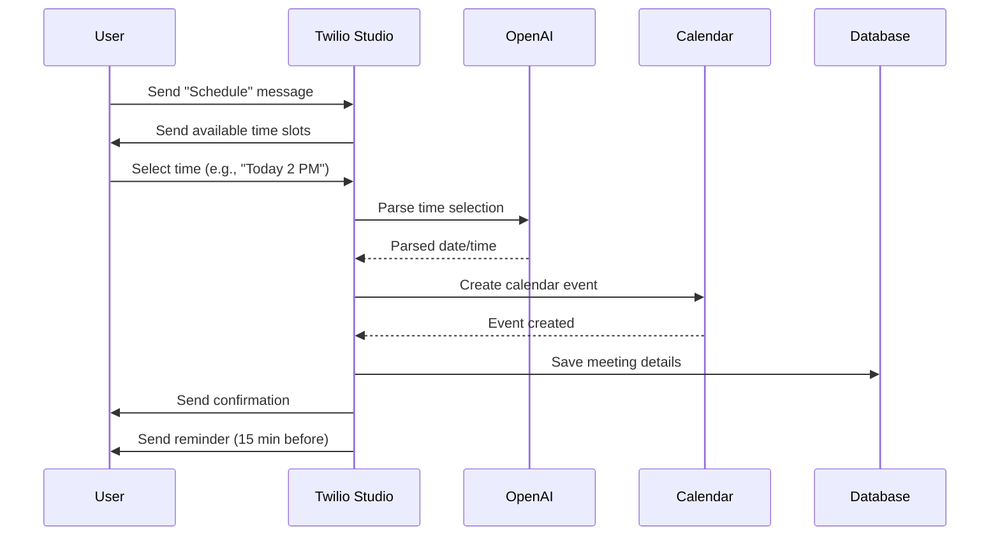
```mermaid
sequenceDiagram
    participant U as User
    participant TS as Twilio Studio
    participant AI as OpenAI
    participant CAL as Calendar
    participant DB as Database
    
    U->>TS: Send "Schedule" message
    TS->>U: Send available time slots
    U->>TS: Select time (e.g., "Today 2 PM")
    TS->>AI: Parse time selection
    AI-->>TS: Parsed date/time
    TS->>CAL: Create calendar event
    CAL-->>TS: Event created
    TS->>DB: Save meeting details
    TS->>U: Send confirmation
    TS->>U: Send reminder (15 min before)
```

---

## 📊 Data Flow Diagrams

### **Data Processing Flow**

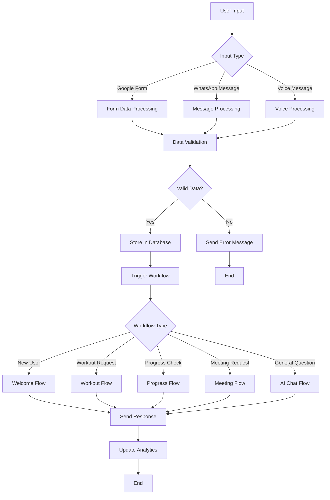
```mermaid
flowchart TD
    A[User Input] --> B{Input Type}
    
    B -->|Google Form| C[Form Data Processing]
    B -->|WhatsApp Message| D[Message Processing]
    B -->|Voice Message| E[Voice Processing]
    
    C --> F[Data Validation]
    D --> F
    E --> F
    
    F --> G{Valid Data?}
    G -->|Yes| H[Store in Database]
    G -->|No| I[Send Error Message]
    
    H --> J[Trigger Workflow]
    I --> K[End]
    
    J --> L{Workflow Type}
    L -->|New User| M[Welcome Flow]
    L -->|Workout Request| N[Workout Flow]
    L -->|Progress Check| O[Progress Flow]
    L -->|Meeting Request| P[Meeting Flow]
    L -->|General Question| Q[AI Chat Flow]
    
    M --> R[Send Response]
    N --> R
    O --> R
    P --> R
    Q --> R
    
    R --> S[Update Analytics]
    S --> T[End]
```

### **Database Schema Relationships**

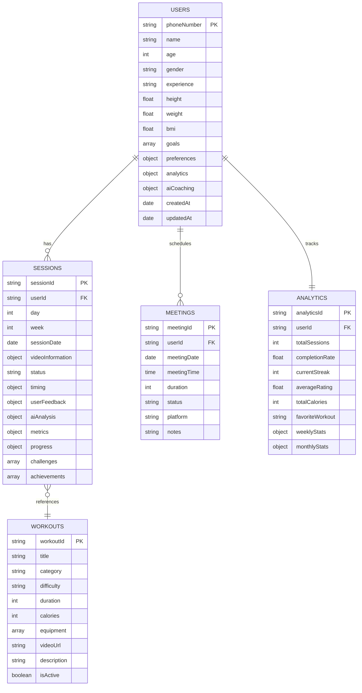
```mermaid
erDiagram
    USERS {
        string phoneNumber PK
        string name
        int age
        string gender
        string experience
        float height
        float weight
        float bmi
        array goals
        object preferences
        object analytics
        object aiCoaching
        date createdAt
        date updatedAt
    }
    
    SESSIONS {
        string sessionId PK
        string userId FK
        int day
        int week
        date sessionDate
        object videoInformation
        string status
        object timing
        object userFeedback
        object aiAnalysis
        object metrics
        object progress
        array challenges
        array achievements
    }
    
    WORKOUTS {
        string workoutId PK
        string title
        string category
        string difficulty
        int duration
        int calories
        array equipment
        string videoUrl
        string description
        boolean isActive
    }
    
    MEETINGS {
        string meetingId PK
        string userId FK
        date meetingDate
        time meetingTime
        int duration
        string status
        string platform
        string notes
    }
    
    ANALYTICS {
        string analyticsId PK
        string userId FK
        int totalSessions
        float completionRate
        int currentStreak
        float averageRating
        int totalCalories
        string favoriteWorkout
        object weeklyStats
        object monthlyStats
    }
    
    USERS ||--o{ SESSIONS : "has"
    USERS ||--o{ MEETINGS : "schedules"
    USERS ||--|| ANALYTICS : "tracks"
    SESSIONS }o--|| WORKOUTS : "references"
```

---

## 🏆 Platform Comparison

### **Feature Comparison Matrix**

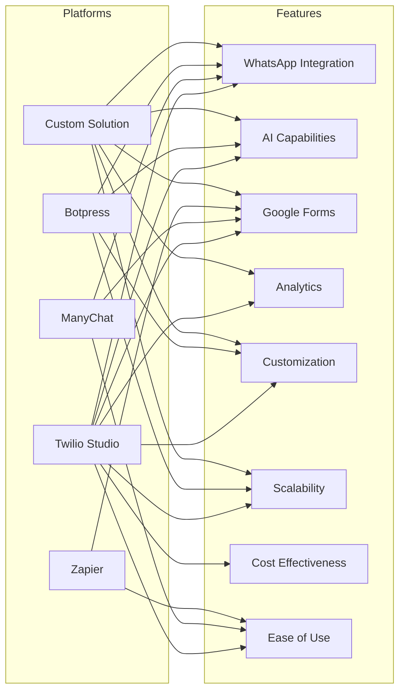
```mermaid
graph LR
    subgraph "Platforms"
        TS[Twilio Studio]
        MC[ManyChat]
        BP[Botpress]
        ZP[Zapier]
        CS[Custom Solution]
    end
    
    subgraph "Features"
        F1[WhatsApp Integration]
        F2[AI Capabilities]
        F3[Google Forms]
        F4[Analytics]
        F5[Customization]
        F6[Scalability]
        F7[Cost Effectiveness]
        F8[Ease of Use]
    end
    
    TS --> F1
    TS --> F2
    TS --> F3
    TS --> F4
    TS --> F5
    TS --> F6
    TS --> F7
    TS --> F8
    
    MC --> F1
    MC --> F3
    MC --> F8
    
    BP --> F1
    BP --> F2
    BP --> F5
    BP --> F6
    
    ZP --> F3
    ZP --> F8
    
    CS --> F1
    CS --> F2
    CS --> F3
    CS --> F4
    CS --> F5
    CS --> F6
```

---

## 💰 Pricing Analysis

### **Detailed Pricing Comparison**

| Platform | Setup Cost | Monthly Cost (100 users) | Monthly Cost (500 users) | Monthly Cost (1000 users) | Scalability | ROI |
|----------|------------|-------------------------|-------------------------|--------------------------|-------------|-----|
| **Twilio Studio** | $0 | $25 | $125 | $250 | ⭐⭐⭐⭐⭐ | ⭐⭐⭐⭐⭐ |
| **ManyChat** | $0 | $25 | $75 | $150 | ⭐⭐⭐ | ⭐⭐⭐⭐ |
| **Botpress** | $0 | $50 | $200 | $400 | ⭐⭐⭐⭐ | ⭐⭐⭐ |
| **Zapier** | $0 | $50 | $120 | $240 | ⭐⭐ | ⭐⭐⭐ |
| **Custom Solution** | $1000+ | $100 | $200 | $300 | ⭐⭐⭐⭐⭐ | ⭐⭐ |

### **Cost Breakdown by Platform**

#### **1. Twilio Studio (RECOMMENDED)**

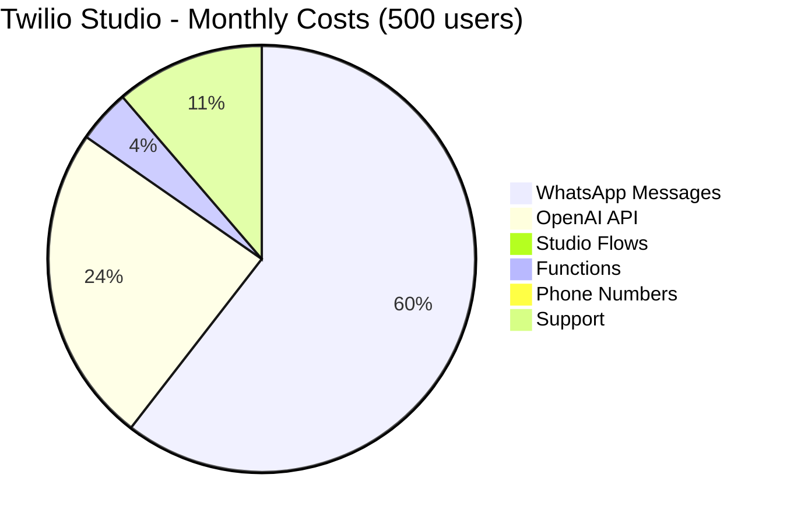
```mermaid
pie title Twilio Studio - Monthly Costs (500 users)
    "WhatsApp Messages" : 75
    "OpenAI API" : 30
    "Studio Flows" : 0
    "Functions" : 5
    "Phone Numbers" : 1
    "Support" : 14
```

**Monthly Breakdown:**
- **100 users**: $25/month
  - WhatsApp: $15
  - OpenAI: $10
- **500 users**: $125/month
  - WhatsApp: $75
  - OpenAI: $30
  - Functions: $5
  - Support: $15
- **1000 users**: $250/month
  - WhatsApp: $150
  - OpenAI: $60
  - Functions: $10
  - Support: $30

#### **2. ManyChat**

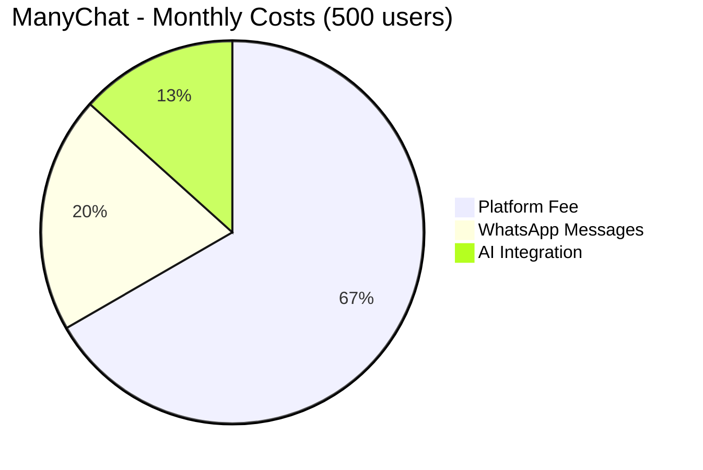
```mermaid
pie title ManyChat - Monthly Costs (500 users)
    "Platform Fee" : 50
    "WhatsApp Messages" : 15
    "AI Integration" : 10
```

**Monthly Breakdown:**
- **100 users**: $25/month
  - Platform: $15
  - Messages: $10
- **500 users**: $75/month
  - Platform: $50
  - Messages: $15
  - AI: $10
- **1000 users**: $150/month
  - Platform: $100
  - Messages: $30
  - AI: $20

#### **3. Custom Solution**

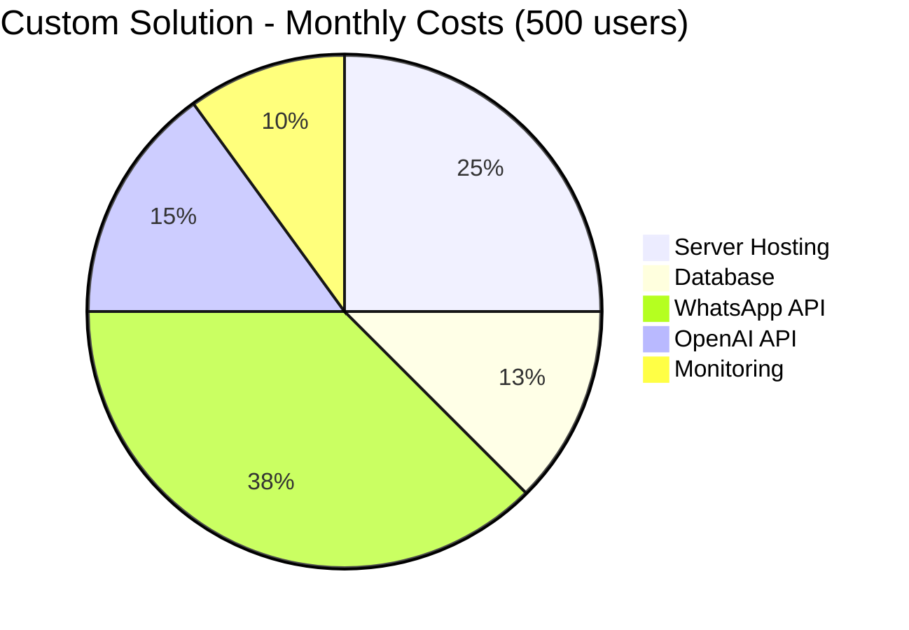
```mermaid
pie title Custom Solution - Monthly Costs (500 users)
    "Server Hosting" : 50
    "Database" : 25
    "WhatsApp API" : 75
    "OpenAI API" : 30
    "Monitoring" : 20
```

**Monthly Breakdown:**
- **100 users**: $100/month
  - Hosting: $20
  - Database: $10
  - WhatsApp: $15
  - OpenAI: $10
  - Monitoring: $5
- **500 users**: $200/month
  - Hosting: $50
  - Database: $25
  - WhatsApp: $75
  - OpenAI: $30
  - Monitoring: $20
- **1000 users**: $300/month
  - Hosting: $100
  - Database: $50
  - WhatsApp: $150
  - OpenAI: $60
  - Monitoring: $40

### **ROI Analysis**

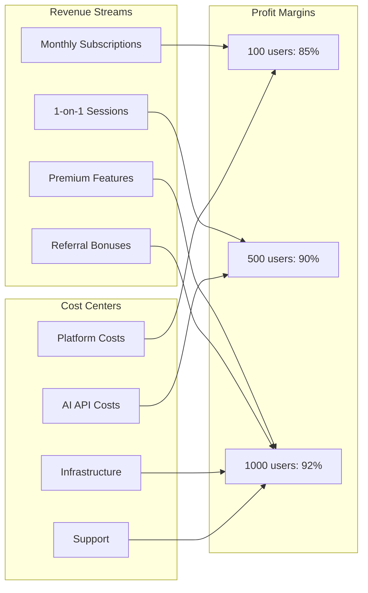
```mermaid
graph LR
    subgraph "Revenue Streams"
        R1[Monthly Subscriptions]
        R2[1-on-1 Sessions]
        R3[Premium Features]
        R4[Referral Bonuses]
    end
    
    subgraph "Cost Centers"
        C1[Platform Costs]
        C2[AI API Costs]
        C3[Infrastructure]
        C4[Support]
    end
    
    subgraph "Profit Margins"
        P1[100 users: 85%]
        P2[500 users: 90%]
        P3[1000 users: 92%]
    end
    
    R1 --> P1
    R2 --> P2
    R3 --> P3
    R4 --> P3
    
    C1 --> P1
    C2 --> P2
    C3 --> P3
    C4 --> P3
```

### **Break-even Analysis**

| Platform | Break-even Users | Monthly Revenue Needed | Time to Break-even |
|----------|------------------|----------------------|-------------------|
| **Twilio Studio** | 25 users | $50 | 1-2 months |
| **ManyChat** | 30 users | $75 | 2-3 months |
| **Botpress** | 50 users | $100 | 3-4 months |
| **Zapier** | 40 users | $80 | 2-3 months |
| **Custom Solution** | 100 users | $200 | 6-8 months |

---

## 🔧 Technical Specifications

### **System Requirements**

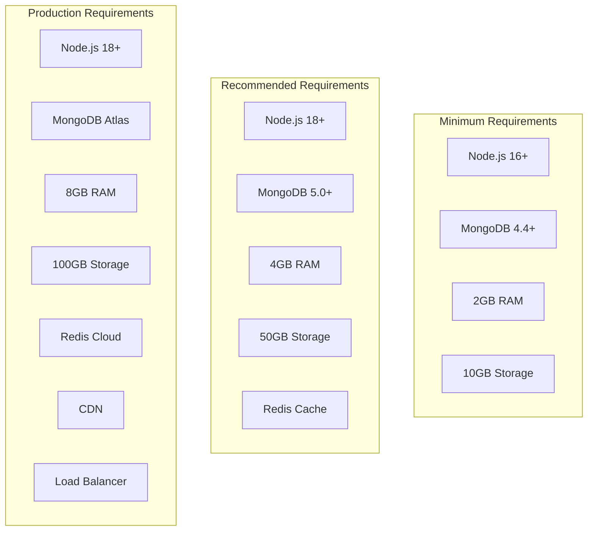
```mermaid
graph TD
    subgraph "Minimum Requirements"
        MR1[Node.js 16+]
        MR2[MongoDB 4.4+]
        MR3[2GB RAM]
        MR4[10GB Storage]
    end
    
    subgraph "Recommended Requirements"
        RR1[Node.js 18+]
        RR2[MongoDB 5.0+]
        RR3[4GB RAM]
        RR4[50GB Storage]
        RR5[Redis Cache]
    end
    
    subgraph "Production Requirements"
        PR1[Node.js 18+]
        PR2[MongoDB Atlas]
        PR3[8GB RAM]
        PR4[100GB Storage]
        PR5[Redis Cloud]
        PR6[CDN]
        PR7[Load Balancer]
    end
```

### **Performance Metrics**

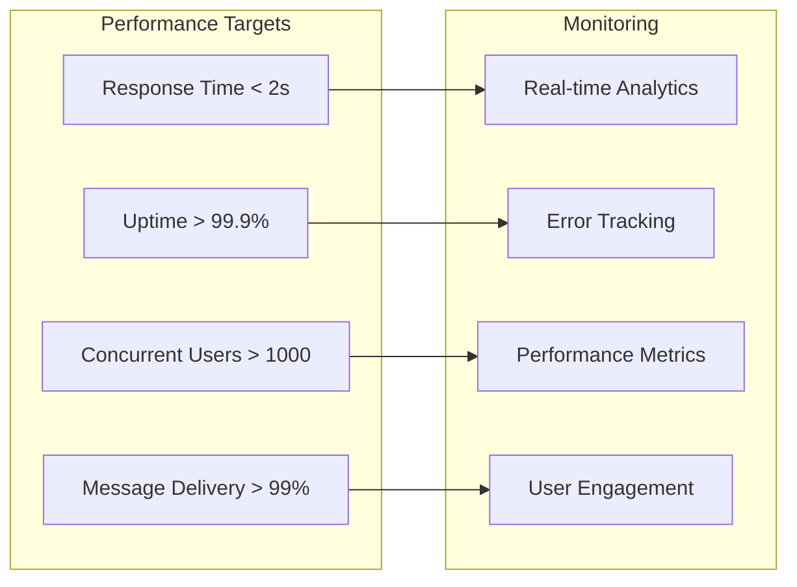
```mermaid
graph LR
    subgraph "Performance Targets"
        PT1[Response Time < 2s]
        PT2[Uptime > 99.9%]
        PT3[Concurrent Users > 1000]
        PT4[Message Delivery > 99%]
    end
    
    subgraph "Monitoring"
        M1[Real-time Analytics]
        M2[Error Tracking]
        M3[Performance Metrics]
        M4[User Engagement]
    end
    
    PT1 --> M1
    PT2 --> M2
    PT3 --> M3
    PT4 --> M4
```

---

## 🚀 Deployment Architecture

### **Twilio Studio Deployment**

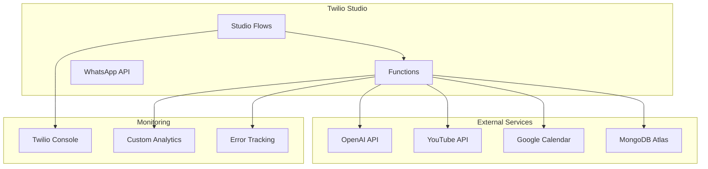
```mermaid
graph TB
    subgraph "Twilio Studio"
        TS1[Studio Flows]
        TS2[Functions]
        TS3[WhatsApp API]
    end
    
    subgraph "External Services"
        ES1[OpenAI API]
        ES2[YouTube API]
        ES3[Google Calendar]
        ES4[MongoDB Atlas]
    end
    
    subgraph "Monitoring"
        M1[Twilio Console]
        M2[Custom Analytics]
        M3[Error Tracking]
    end
    
    TS1 --> TS2
    TS2 --> ES1
    TS2 --> ES2
    TS2 --> ES3
    TS2 --> ES4
    
    TS1 --> M1
    TS2 --> M2
    TS2 --> M3
```

### **Custom Solution Deployment**

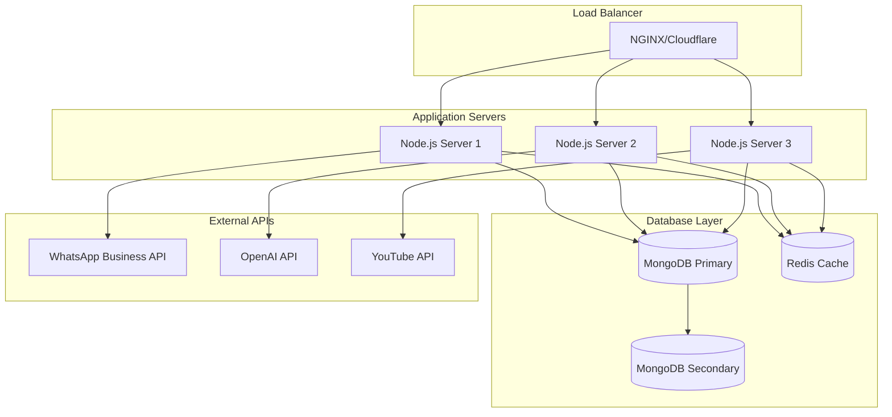
```mermaid
graph TB
    subgraph "Load Balancer"
        LB[NGINX/Cloudflare]
    end
    
    subgraph "Application Servers"
        AS1[Node.js Server 1]
        AS2[Node.js Server 2]
        AS3[Node.js Server 3]
    end
    
    subgraph "Database Layer"
        DB1[(MongoDB Primary)]
        DB2[(MongoDB Secondary)]
        DB3[(Redis Cache)]
    end
    
    subgraph "External APIs"
        API1[WhatsApp Business API]
        API2[OpenAI API]
        API3[YouTube API]
    end
    
    LB --> AS1
    LB --> AS2
    LB --> AS3
    
    AS1 --> DB1
    AS2 --> DB1
    AS3 --> DB1
    
    DB1 --> DB2
    AS1 --> DB3
    AS2 --> DB3
    AS3 --> DB3
    
    AS1 --> API1
    AS2 --> API2
    AS3 --> API3
```

---

## 📈 Growth Projections

### **User Growth Model**

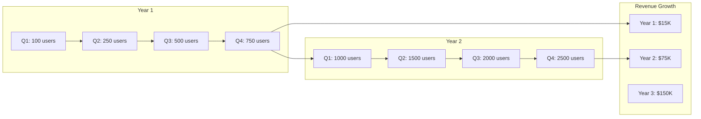
```mermaid
graph LR
    subgraph "Year 1"
        Y1Q1[Q1: 100 users]
        Y1Q2[Q2: 250 users]
        Y1Q3[Q3: 500 users]
        Y1Q4[Q4: 750 users]
    end
    
    subgraph "Year 2"
        Y2Q1[Q1: 1000 users]
        Y2Q2[Q2: 1500 users]
        Y2Q3[Q3: 2000 users]
        Y2Q4[Q4: 2500 users]
    end
    
    subgraph "Revenue Growth"
        R1[Year 1: $15K]
        R2[Year 2: $75K]
        R3[Year 3: $150K]
    end
    
    Y1Q1 --> Y1Q2
    Y1Q2 --> Y1Q3
    Y1Q3 --> Y1Q4
    Y1Q4 --> Y2Q1
    Y2Q1 --> Y2Q2
    Y2Q2 --> Y2Q3
    Y2Q3 --> Y2Q4
    
    Y1Q4 --> R1
    Y2Q4 --> R2
```

### **Cost vs Revenue Projection**

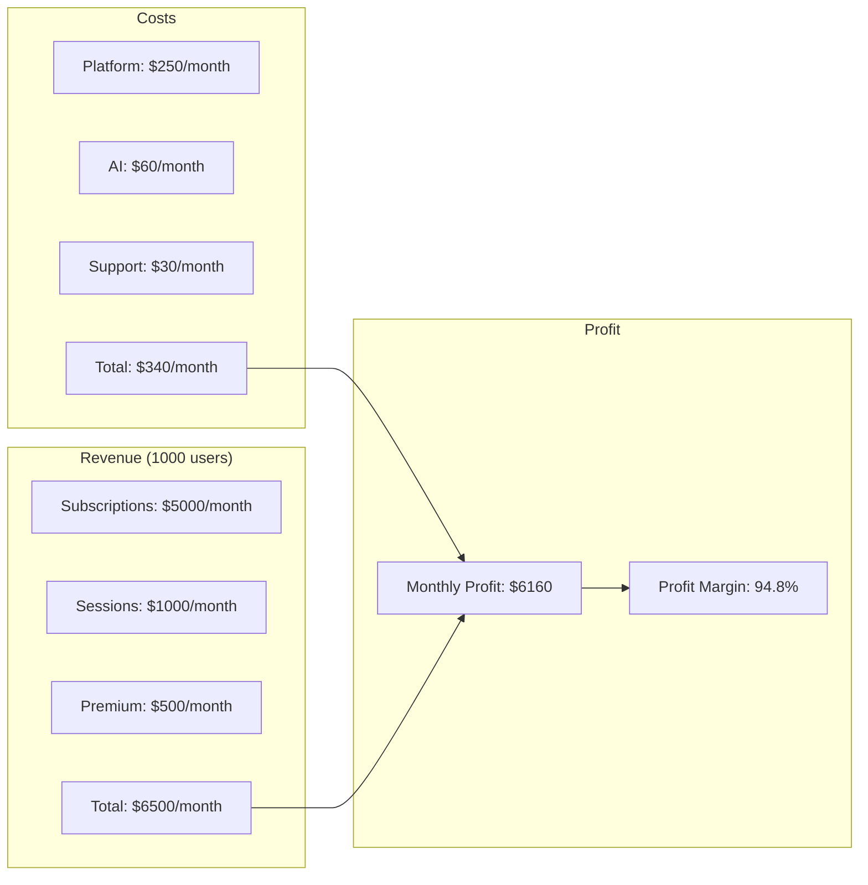
```mermaid
graph LR
    subgraph "Costs"
        C1[Platform: $250/month]
        C2[AI: $60/month]
        C3[Support: $30/month]
        C4[Total: $340/month]
    end
    
    subgraph "Revenue (1000 users)"
        R1[Subscriptions: $5000/month]
        R2[Sessions: $1000/month]
        R3[Premium: $500/month]
        R4[Total: $6500/month]
    end
    
    subgraph "Profit"
        P1[Monthly Profit: $6160]
        P2[Profit Margin: 94.8%]
    end
    
    C4 --> P1
    R4 --> P1
    P1 --> P2
```

---

## 🎯 Recommendations

### **Platform Selection Matrix**

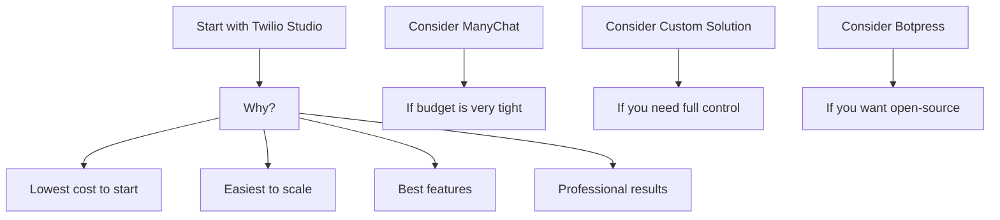
```mermaid
graph TD
    A[Start with Twilio Studio] --> B[Why?]
    B --> C[Lowest cost to start]
    B --> D[Easiest to scale]
    B --> E[Best features]
    B --> F[Professional results]
    
    G[Consider ManyChat] --> H[If budget is very tight]
    I[Consider Custom Solution] --> J[If you need full control]
    K[Consider Botpress] --> L[If you want open-source]
```

### **Implementation Timeline**

```mermaid
gantt
    title Fitness Bot Implementation Timeline
    dateFormat  YYYY-MM-DD
    section Phase 1: Foundation
    Twilio Setup           :done, setup, 2024-01-01, 2d
    Basic Flows           :done, flows, 2024-01-03, 3d
    Testing               :done, test, 2024-01-06, 2d
    
    section Phase 2: Core Features
    AI Integration        :active, ai, 2024-01-08, 4d
    Google Forms          :forms, 2024-01-12, 2d
    Workout System        :workout, 2024-01-14, 3d
    
    section Phase 3: Advanced Features
    Analytics             :analytics, 2024-01-17, 3d
    Meeting Scheduler     :meeting, 2024-01-20, 2d
    Progress Tracking     :progress, 2024-01-22, 2d
    
    section Phase 4: Launch
    Beta Testing          :beta, 2024-01-24, 3d
    Launch                :launch, 2024-01-27, 1d
    Optimization          :optimize, 2024-01-28, 7d
```

---

## 📊 Success Metrics

### **Key Performance Indicators**

```mermaid
graph LR
    subgraph "User Engagement"
        UE1[Daily Active Users]
        UE2[Workout Completion Rate]
        UE3[Response Rate]
        UE4[Session Duration]
    end
    
    subgraph "Business Metrics"
        BM1[Monthly Recurring Revenue]
        BM2[Customer Acquisition Cost]
        BM3[Customer Lifetime Value]
        BM4[Churn Rate]
    end
    
    subgraph "Technical Metrics"
        TM1[System Uptime]
        TM2[Response Time]
        TM3[Error Rate]
        TM4[API Usage]
    end
    
    UE1 --> BM1
    UE2 --> BM3
    UE3 --> BM2
    UE4 --> BM4
    
    TM1 --> BM1
    TM2 --> UE1
    TM3 --> BM4
    TM4 --> BM1
```

---

**This comprehensive design documentation provides a complete blueprint for building and scaling your WhatsApp fitness bot across different platforms with detailed cost analysis and implementation guidance. 🚀**
